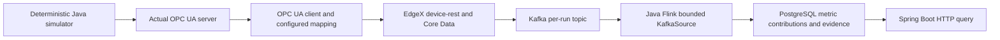

# Normal production service path (Issue #4)

## Local entry

Prerequisites: Docker Desktop with Linux containers, Java 17 or 21, Maven 3.9,
and PowerShell (Windows PowerShell 5.1 or PowerShell 7). Allow about 2 GB of
additional memory for the demo services and embedded Flink runtime. First use
downloads the pinned dependencies and container images.

From the repository root:

```powershell
./scripts/demo.ps1
```

The entry builds and starts the Compose project `iiot-issue4`, waits for service
health, builds the Java application when no ready API exists, starts it in the background when needed,
and checks PostgreSQL, Kafka, OPC UA and EdgeX before submitting production.
It creates a fresh run from `deploy/normal-v1.json` with seed 42 and saves the
actual configuration, run versions and queried metrics to
`target/normal-demo-result.json`. Java logs and PID are in `target/service*`.

```powershell
./scripts/demo.ps1 -Mode Check
./scripts/demo.ps1 -NoStart -RunId normal-review-1
```

`Check` never starts services. Missing dependencies produce a nonzero exit code
and a named readiness failure. `NoStart` uses an existing local API. Reusing a
run identity with identical inputs returns the existing run; different inputs
with that identity return HTTP 409. A failed run remains failed and is not
presented as a successful report; choose a new run identity for another attempt.

Readiness requests allow 20 seconds. Protocol publication allows 240 seconds,
the command's production request allows 360 seconds, and its acceptance-test
subprocess allows 420 seconds. These are bounded timeout budgets, not promised
runtime durations; real OPC UA/EdgeX event publication is performed serially.

The API binds to 127.0.0.1:18085 when launched by the script. Other published
ports are 14840 (OPC UA), 18084 (ingestion), 15980/15981 (EdgeX data/metadata),
15432 (PostgreSQL) and 19092 (Kafka). Credentials and nonsecure protocol settings
are for this loopback-only local demo.

Packaging uses a regular executable JAR with its runtime dependencies in the
adjacent `production-service/target/lib/` directory. Keep that directory with
the JAR. This allows Flink's system class loader to resolve all job classes;
the nested Spring Boot JAR layout failed the direct-launch acceptance test.
See [Spring Boot class-loader restrictions](https://docs.spring.io/spring-boot/specification/executable-jar/restrictions.html).
Stop the demo Java process before rebuilding on Windows, where a running JAR
is locked. The script records its PID in `target/service.pid`; normal repeat
invocations reuse the ready application and avoid rebuilding the locked JAR.

## Data flow



The ingestion extension is a Python protocol adapter using asyncua, not an
algorithm service. Four OPC UA String nodes represent atomic observable
events. The adapter reads actual OPC UA DataValues, maps their status to event
quality and measures transport elapsed time; original times remain elapsed
milliseconds from simulation start. `ingestion/mapping.json` names the line,
station/device mapping, time unit and mapping/format versions. Unknown mapping
identities, invalid sequence/time and unsupported fields are rejected.

EdgeX's actual device SDK receives these values through device-rest. Core Data
must persist them before the adapter returns an EdgeX event identity and its
stored reading. Only those read-back values are published to Kafka. Protocol
acceptance independently reads Core Data by that returned identity.

For this finite-order slice, Spring Boot coordinates publication and launches
a bounded embedded Java Flink job. KafkaSource captures stopping offsets;
Flink derives outlet good/rejected contributions, line-entry/exit WIP changes
and basic state facts, then its JDBC sink writes evidence and contributions
to PostgreSQL. Event identity is the database uniqueness boundary.
HTTP queries aggregate those persisted contributions for a selected run,
batch and original-time range. They do not recalculate production from seed.

## HTTP contract

| Method and route | Behavior |
| --- | --- |
| GET `/api/ready` | Real dependency checks; 200 when ready, 503 otherwise |
| POST `/api/runs` | Effective `ProductionLine.Configuration` JSON; returns the persisted run after the full path completes |
| GET `/api/runs/{runId}` | Input configuration, seed, status, output coverage and result versions |
| GET `/api/runs/{runId}/events` | Persisted observable evidence with original time, per-device sequence, quality, versions, EdgeX identity and basic state |
| GET `/api/lines/line-a/metrics` | Required `runId`, `startMillis`, `endMillis`; optional `batchId` and `warmupMillis` |

Metrics use `[max(startMillis, warmupMillis), endMillis)`. Good and rejected
units are counted only at station four. Ending WIP includes all entries before
the end, including entries during warmup, minus outlet decisions before the
end. Zero duration returns JSON null for JPH. Queries outside the observed
range are parameter errors; unfinished runs cannot yield valid metrics.
The scope is `INCLUDING_CHANGEOVER`, with explicit simulated-device time
confidence and versioned inputs, configuration hash, mapping, format,
calculation and statistics. Rule diagnostics are marked not used.

## Automated acceptance

```powershell
docker compose -f deploy/compose.yaml up -d --build --wait --wait-timeout 180
python -m unittest ingestion/test_protocol.py -v
mvn -B -ntp -P integration verify
```

The integration profile is explicit: missing real services fail the acceptance
suite, rather than skip it. `mvn test` runs the offline simulator tests only.
The normal-path tests use real HTTP and independently count simulator outlet
facts and workpiece entry/exit sets. They cover warmup, exact endpoints, batch
filtering, zero duration, command reproducibility, direct executable-JAR launch
and named dependency failures without creating a run or report. Browser UI and abnormal
diagnosis/approval flows belong to subsequent issues.

## Implementation limits

This is a local, finite-order normal-production path. It does not implement an
always-on industrial OPC UA device service, online pause diagnosis, historical
correction, full failure recovery, distributed Flink deployment or exactly-once
claims. PostgreSQL stores evidence needed for these short demonstrations; Kafka
topics and EdgeX readings persist for inspection during the Compose session.
Long-lived retention and cleanup policies belong to the later event-quality and
acceptance slices. The offline in-memory metrics helper still assumes complete
observations and is not used by this service.

Protocol and dependency references: [EdgeX device-rest](https://docs.edgexfoundry.org/3.1/microservices/device/services/device-rest/GettingStarted/),
[asyncua](https://github.com/FreeOpcUa/opcua-asyncio),
[Flink KafkaSource](https://nightlies.apache.org/flink/flink-docs-release-1.20/docs/connectors/datastream/kafka/).
