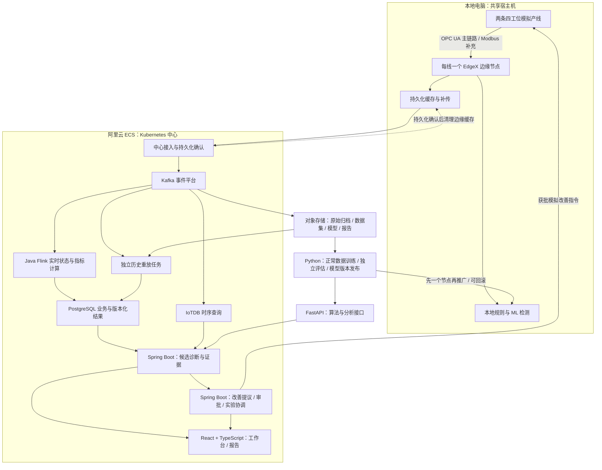

# 工业智能平台：整体框架与核心功能

本文记录已确认的设计目标与功能范围，尚不代表已完成实现或验收。领域含义见 [CONTEXT.md](../../CONTEXT.md)，架构取舍见 [文档导航](../README.md) 中的六份架构决策记录；未决项保留在本文末尾。

## 项目目标与边界

面向智能制造管培生面试，通过可运行项目展示工业业务理解、技术实现、系统性分析、工程取舍与价值验证能力。项目证据来自可控模拟实验，不宣称真实客户交付、真实团队协作或真实产线改善成绩。

核心业务主线：产能不足 → 微停识别 → 候选瓶颈定位 → 改善建议 → 人工审批 → 模拟改善 → 合格品 JPH 验证。

预测性维护、能耗优化、完整资产 BOM 保留为扩展方向，不属于核心验收范围。基础产线拓扑和设备身份仍属于核心功能。

## 整体架构

图中箭头表示逻辑职责，不锁定连接器、跨库事务或具体通信实现。改善执行仅面向模拟器，执行通道、权限和审计在实现时补齐。

## 应用与算法职责

| 部分 | 技术 | 职责 |
|---|---|---|
| 核心业务应用 | Java + Spring Boot | 资产配置、诊断记录、改善审批、实验协调、审计、报告与结果版本 |
| 流式任务 | Java + Flink | 工位状态、事件时间、指标与候选证据计算、检查点恢复和历史重放 |
| 算法与分析 | Python + FastAPI | 模型评估、分析查询与推理接口；scikit-learn 承担首版模型，MLflow 管理实验与模型版本 |
| 边缘检测 | 本地规则与已发布模型 | 断连时继续运行；不依赖中心 FastAPI 接口在线可用 |
| 用户界面 | React + TypeScript | 工程师工作台、管理者报告与审批操作 |

Spring Boot 核心业务采用模块化应用：配置、诊断、审批、实验、报告通过明确接口协作，保持数据归属与权限边界。流计算与算法因运行方式不同独立部署。Spring Modulith 保留为模块边界验证工具候选，不作为新的业务功能。

Spring Boot 负责改善授权和执行协调；算法服务输出分析结果与证据，由业务应用形成可审批的建议。边缘模型版本与中心分析版本分别记录，支持核对分批发布期间的差异。

以上选型用于展示工业接入、Java 工程与 Python 算法的分工。企业需求是否满足须依据验收实验评估；当前尚未实现，目标企业的内部技术栈也未得到确认。

## 核心功能清单

| 模块 | 必须实现的能力 |
|---|---|
| 产线模拟 | 两条四工位产线、有限缓冲、两种产品批次切换、显式换型信号、逐件 ID、少量不合格品 |
| 故障实验 | 主演示第二工位微停；测试任意工位单独微停与无故障场景；支持网络、时间与服务故障注入 |
| 设备事件 | 动作开始/结束等原始事实具有设备时间戳与序号；缺号检测与补读；不直接给诊断系统暴露微停答案 |
| 协议与配置 | OPC UA 完整主链路、Modbus TCP 补充信号；同类产线通过版本化配置接入；明确协议能力差异 |
| 边缘处理 | 统一身份、单位、质量和事件格式；本地检测；8 小时断连缓存；实时与补传并行 |
| 缓存降级 | 设计容量内完整保存约定数据；容量不足时优先关键事件、减少高频采样、记录缺口与完整性 |
| 事件与归档 | Kafka 持久化与重放；稳定事件身份；长期归档记录范围、数量、校验值和格式版本 |
| 工业计算 | 工位状态重建；区分加工、微停、缺料、阻塞、换型、数据中断；计算 JPH、OEE 与损失构成 |
| 诊断 | 工位行为层诊断；区分候选源头与受影响工位；输出排序、证据与无法确定的理由 |
| ML | 以已知正常数据学习产品和动作条件下的正常模式；动作中检测、结束后确认；与规则基线比较 |
| 模型运维 | 独立评估、版本化发布、先单节点更新、失败保留旧版、回滚；检测记录模型版本 |
| 历史修正 | 补传触发独立重放；恢复必要起点状态；核验后发布修正版；保留旧结果和修正原因 |
| 改善闭环 | 工程师提议、独立管理者账号批准或驳回、后端权限校验、审计、方案或证据变化后重新审批 |
| 效果实验 | 人工批准后消除模拟微停诱因；多组成对实验；控制订单、产品组合、初始状态和随机条件 |
| 数据查询 | IoTDB 查询采样；PostgreSQL 管理资产配置、审批、诊断与结果版本；处理重试和跨库不一致 |
| 工程师界面 | 产线概览、工位与工件时间线、原始证据、诊断候选、改善提议、审批状态、实验结果 |
| 管理者界面 | 产出差距、问题摘要、改善审批、进度、收益与数据完整性报告 |
| 时间质量 | 自动时间校正、保留原始时间与校正依据；误差过大时按分析类型降级；可靠单调计时下保留本机分析 |
| 部署与运维 | 本地开发入口、云边部署、中心多节点 Kubernetes、监控与故障恢复实验 |

## 核心验收证据

- 合格品 JPH 是首要业务指标；OEE、微停损失和质量指标解释变化。分别报告产品、稳定生产阶段和包含换型的整体运行结果。
- 原始诊断输入不得含隐藏故障位置、故障真值或未来数据；真实可知的产品与工况配置可以使用。
- 0.5–10 秒额外停顿用于在线检测实验；50–500 毫秒停顿用于事件追溯和事后分析。并不预先承诺所有停顿均可检出。
- 规则基线按产品配置合理阈值。规则与 ML 在每条线每 8 小时最多 1 次误报的目标下比较，报告检出率、延迟、未检出和拒绝判断比例；目标是否达成由独立实验决定。
- 训练、调参与测试按独立运行划分；独立测试包含新随机种子和未见参数组合。训练和调参不得使用最终测试结果。
- 成对实验控制正常随机过程与故障过程；同一工件的质量结果一致，避免干预改变随机数消费顺序而破坏对照。
- 报告预热阶段、统计时长、期末在制品以及多组结果的不确定性，区分暂时释放库存与持续产能改善。
- 报告绑定数据、配置、模型、计算与实验版本，支持再次重放核验。
- 两个边缘节点独立断连与恢复；本地共享宿主机，不能据此宣称物理机器级容错。
- 中心验收工作节点故障；已确认持久化的事件在约定故障范围内不丢失，允许暂时暂停，恢复后核验遗漏与重复计数。
- 采集和事件保存优先；查询可短暂滞后；训练和报告可暂停恢复。控制平面高可用不属于已选验收范围。

## 技术选型状态

| 状态 | 内容 |
|---|---|
| 已确认 | OPC UA、Modbus TCP、EdgeX、自定义设备与应用扩展、Kafka、Java Flink、Java + Spring Boot 核心业务、Python + FastAPI 算法服务、React + TypeScript、scikit-learn、MLflow、IoTDB、PostgreSQL、对象存储、Kubernetes、阿里云 ECS 按需付费 |
| 候选，尚未确认 | Keycloak 身份认证、Prometheus 与 OpenTelemetry 可观测性、Spring Modulith 模块验证 |
| 按核心需要决定 | 边云上传协议与 MQTT、eKuiper、API Gateway、GitOps、日志平台、具体对象存储服务、序列化和 Schema 管理工具 |
| 暂无核心需求 | Neo4j、完整预测性维护/RUL、能耗优化、完整资产 BOM、多级审批、控制平面高可用 |

原始材料中的组件不因出现在选型表中就自动进入实现范围。每个新增组件应有核心功能、可验证职责和部署成本依据。

## 实施顺序

这些是同一最终范围的交付切片，不是删减后续目标。

1. 打通业务链路：一条产线 → OPC UA / EdgeX → Kafka / Java Flink → PostgreSQL → Spring Boot → React 工作台；完成规则诊断、审批与一次改善实验。
2. 完成实验与算法：Python / scikit-learn 正常数据模型、FastAPI 分析接口、MLflow 实验与版本管理、多组成对实验、隐藏真值隔离、未见参数组合、规则对照和管理报告。
3. 完成数据与多线接入：第二条产线、配置复用、Modbus、IoTDB、原始归档、独立重放与结果版本。
4. 完成云边可靠性：8 小时断连、缓存降级、时间质量、模型分批发布、本地边缘与 ECS 中心部署。
5. 完成最终验收：多节点 Kubernetes 工作节点故障、恢复后结果核对、监控、可重复部署、演示与证据整理。

模型、配置、事件和结果的身份字段从第一切片预留；可靠性与兼容细节在相应切片实现，避免后期无法追溯。

## 交付物

- 可运行代码、配置、部署脚本与本地演示入口。
- 架构说明与关键取舍记录，包含各组件边界和未覆盖场景。
- 实验数据集、自动验收脚本、规则与 ML 对照、改善效果报告。
- 断连补传、历史修正和工作节点故障的演示与运行记录。
- 面试讲解材料：业务问题、数据证据、技术实现、失败案例、改善结果和扩展方向。

## 待整体确认

- 身份认证与可观测性组件，以及按核心需要决定的配套组件。
- 可用于部署的本机资源、ECS 规格、预算与实验时长；按需付费不等于已确认预算。
- 开发时间安排与各切片交付日期。

具体告警阈值、缓存参数、校时误差、节点拓扑和格式兼容策略在实施相应模块时解决，不继续逐项扩大当前访谈。
